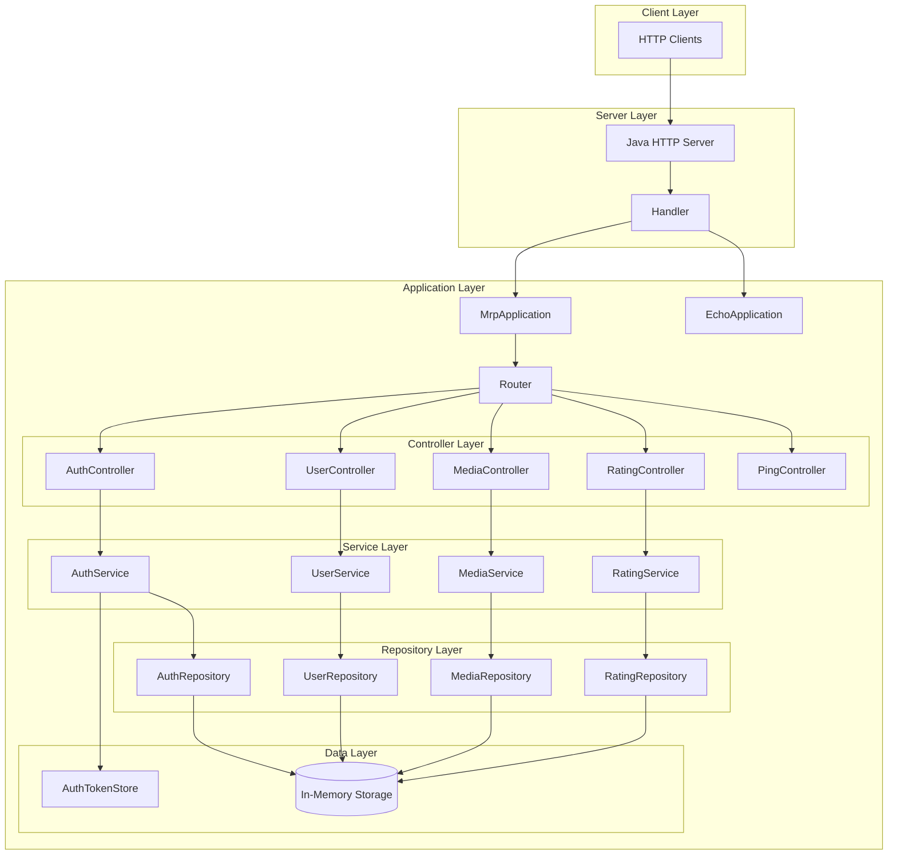
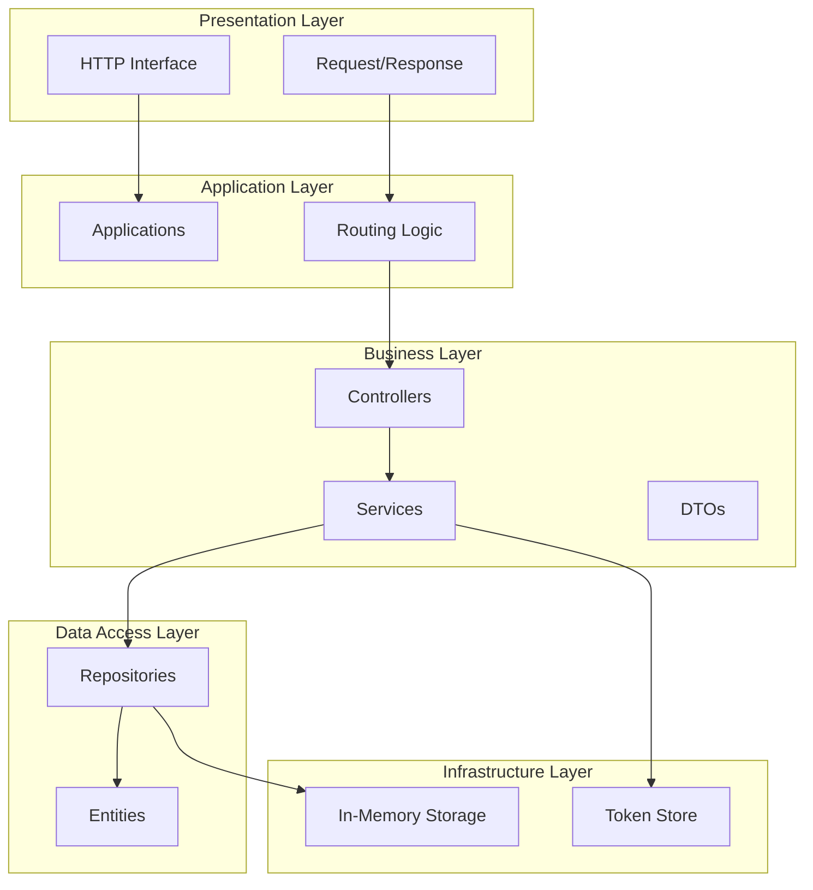
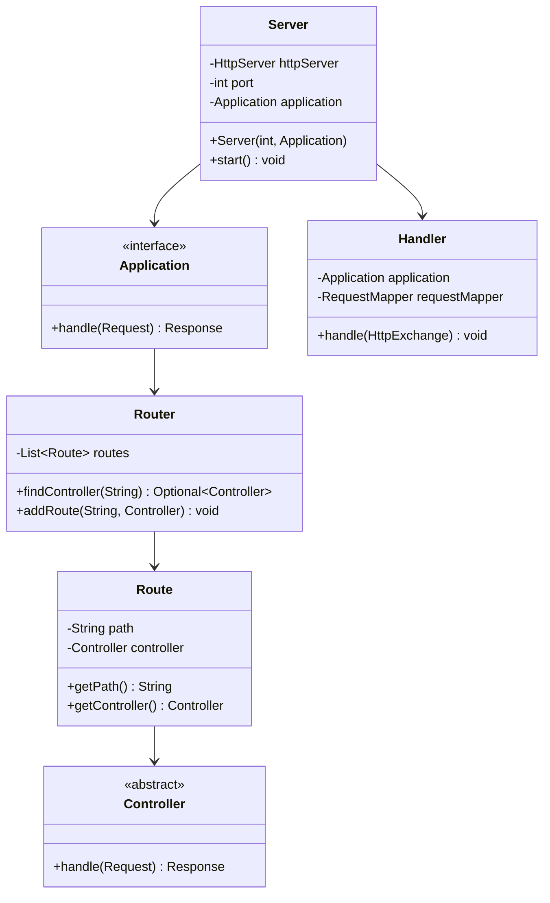
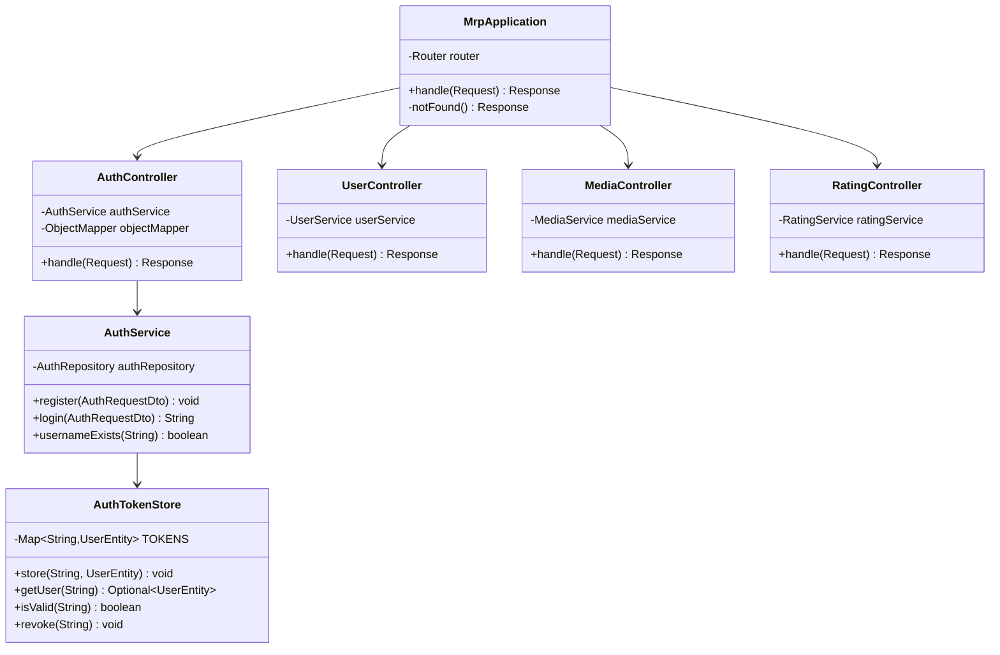
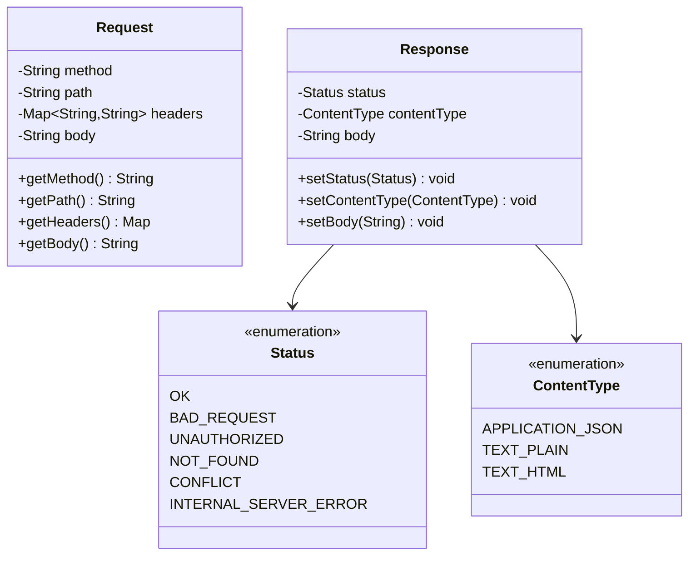
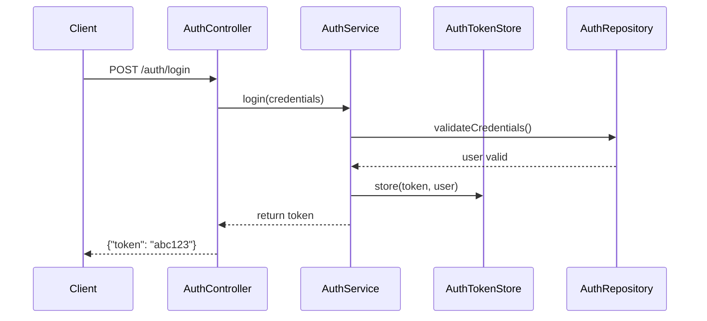

# MRP Project - Projektprotokoll

**Git-Repository:** https://github.com/Pascal07/SWEN_MRP_Project

## Projektübersicht

Das MRP (Media Rating Platform) Projekt ist eine Java-basierte HTTP-Server-Anwendung, die als Plattform für Medien-Bewertungen fungiert. Das System bietet Authentifizierung, Benutzerverwaltung, Medienverwaltung und ein Bewertungssystem.

## Software-Architektur

### Gesamtarchitektur



### Schichtarchitektur



## Klassendiagramm

### Core Framework Classes



### MRP Application Classes



### HTTP Classes



## Technische Entscheidungen und Architekturbeschreibung

### 1. Architektur: Layered Architecture

**Schichten:**
1. **Presentation Layer:** HTTP Request/Response Handling
2. **Application Layer:** Routing und Application Logic
3. **Business Layer:** Controllers und Services
4. **Data Access Layer:** Repositories und Entities
5. **Infrastructure Layer:** Token Storage und Utilities (In-Memory Storage) Teporarily!

**Vorteile:**
- Klare Trennung der Verantwortlichkeiten
- Testbarkeit durch Schichtentrennung
- Wartbarkeit und Erweiterbarkeit

### 3. Routing-Mechanismus

**Entscheidung:** Custom Router mit Pattern-Matching für URL-Routen.

**Implementation:**
```java
// Router registriert Controller für spezifische Pfade
router.addRoute("/users", new UserController());
router.addRoute("/auth", new AuthController());
router.addRoute("/media", new MediaController());
```

**Vorteile:**
- Einfache und verständliche Routing-Logik
- Flexibilität bei Path-Matching
- Zentrale Verwaltung der Routen

### 4. Authentication & Token-Handling

**Entscheidung:** Token-basierte Authentifizierung mit In-Memory Storage. (Teporarily!)

**Implementation:**
- `AuthTokenStore`: Singleton für Token-Verwaltung
- Einfache String-Token (für Demonstration)
- In-Memory `ConcurrentHashMap` für Thread-Safety

**Sicherheitsüberlegungen:**
```java
// Thread-safe Token Storage
private static final Map<String, UserEntity> TOKENS = new ConcurrentHashMap<>();

// Token-Validierung
public static Optional<UserEntity> getUser(String token) {
    return Optional.ofNullable(TOKENS.get(token));
}
```

**Limitierungen:**
- Tokens sind nicht persistent (verloren bei Server-Restart)
- Keine Token-Expiration implementiert
- Einfache String-Tokens (nicht JWT)

### 5. Data Persistence

**Aktueller Stand:** Die Daten werden derzeit temporär im In-Memory Storage gehalten.

**Zukünftige Lösung:** Später werden alle Daten in einer Datenbank gespeichert.

**Begründung für die aktuelle Lösung:**
\- Schnelle und einfache Implementierung für Prototyping
\- Keine externe Datenbank-Konfiguration notwendig

**Nachteile der aktuellen Lösung:**
\- Daten gehen bei Server-Restart verloren
\- Nicht für den produktiven Einsatz geeignet
### 6. JSON-Handling

**Entscheidung:** Jackson ObjectMapper für JSON-Serialisierung/-Deserialisierung.

**Dependencies:**
```xml
<dependency>
    <groupId>com.fasterxml.jackson.core</groupId>
    <artifactId>jackson-databind</artifactId>
    <version>2.17.1</version>
</dependency>
```

**Vorteile:**
- Weit verbreitete und stabile Library
- Gute Performance
- Einfache Integration

### 7. Error Handling

**Entscheidung:** Manuelle Error-Handling mit HTTP-Status-Codes und JSON-Error-Responses.

**Implementation:**
```java
// Beispiel für Error Response
if (raw == null || raw.isBlank()) {
    response.setStatus(Status.BAD_REQUEST);
    response.setBody("{\"error\":\"Request body is empty\"}");
    return response;
}
```

## Technische Schritte und Implementierungsdetails

### 1. Server-Initialisierung

Der Server wird in der `Main`-Klasse gestartet:
```java
Server server = new Server(8080, new MrpApplication());
Server echoServer = new Server(3333, new EchoApplication());
```

### 2. Request-Processing Flow

1. **HTTP Request** wird vom `HttpServer` empfangen
2. **Handler** konvertiert `HttpExchange` zu `Request`-Objekt
3. **Application** verarbeitet Request über Router
4. **Router** findet entsprechenden Controller
5. **Controller** delegiert an Service-Layer
6. **Service** führt Business-Logic aus und nutzt Repository
7. **Response** wird zurück durch die Schichten gereicht

### 3. Authentication Flow



### 4. Modularität und Erweiterbarkeit

Das System ist modular aufgebaut:
- **Neue Controller** können einfach hinzugefügt werden
- **Neue Services** folgen dem gleichen Pattern
- **Authentication** ist wiederverwendbar
- **Error-Handling** ist konsistent implementiert

## Fazit

Das MRP-Projekt demonstriert eine solide, schichtweise Architektur mit klaren Verantwortlichkeiten. Die Implementierung zeigt gute Praktiken für:

- **Separation of Concerns**
- **Dependency Management**
- **HTTP-Request-Handling**
- **Authentication**
- **Error-Handling**
- **SOLID-Prinzipien wurden angewendet**


Die gewählte Architektur ermöglicht einfache Erweiterungen und Wartung, während sie gleichzeitig die Grundlagen der Webentwicklung ohne schwere Frameworks vermittelt.
