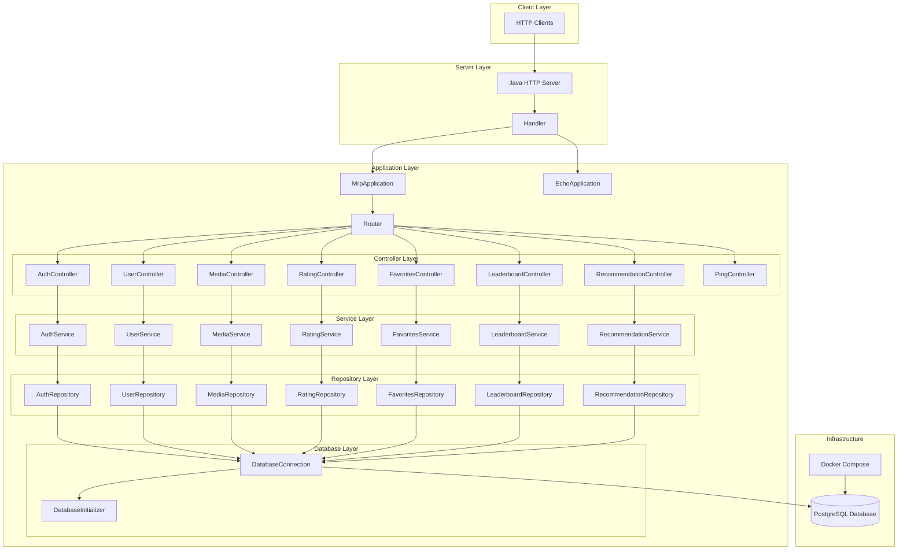
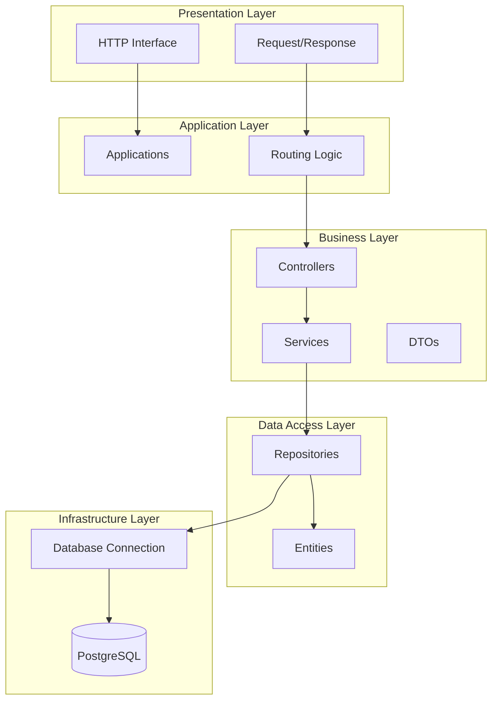
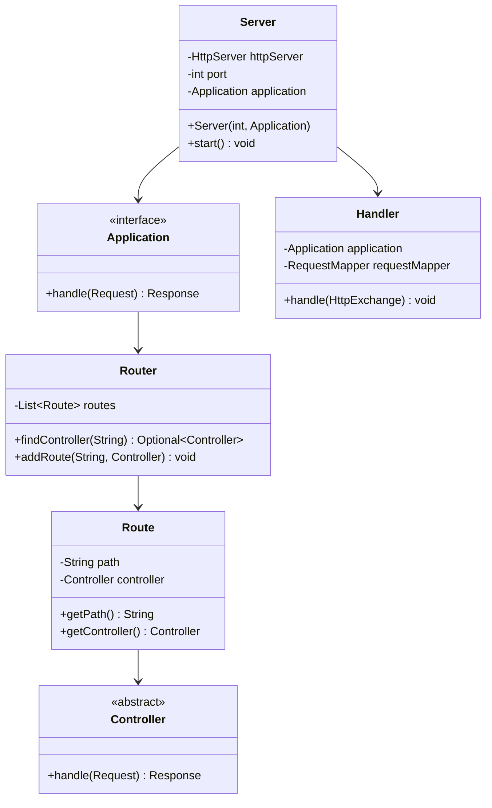
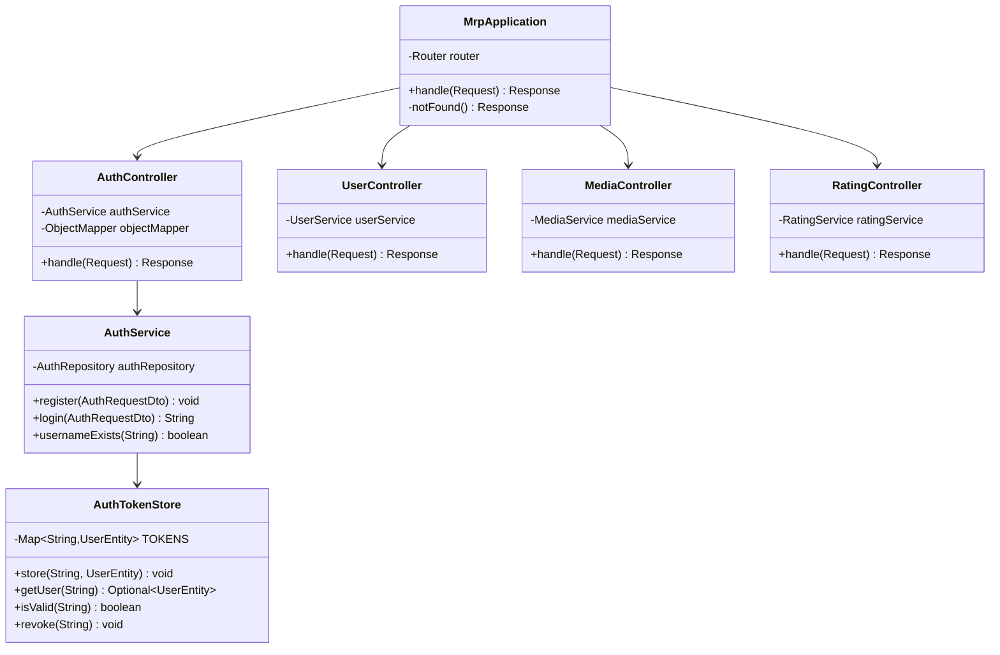
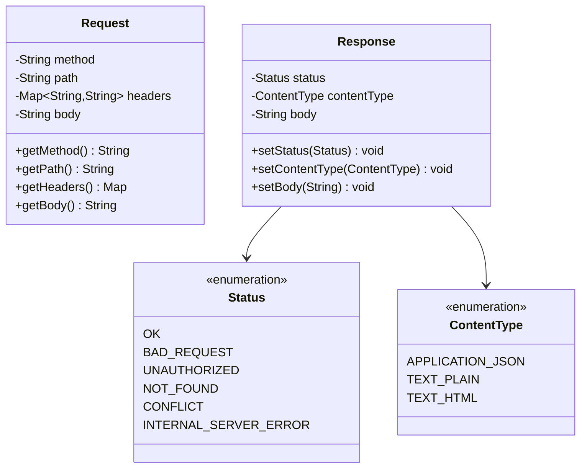
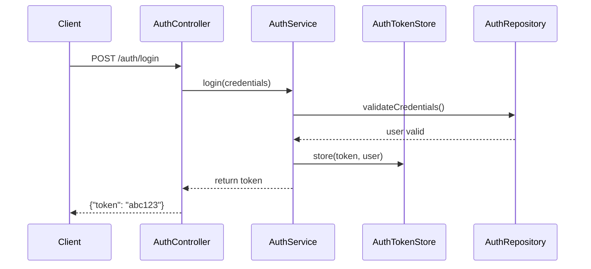

# MRP Project - Projektprotokoll

**Git-Repository:** https://github.com/Pascal07/SWEN_MRP_Project

## Projektübersicht

Das MRP (Media Rating Platform) Projekt ist eine Java-basierte HTTP-Server-Anwendung, die als Plattform für Medien-Bewertungen fungiert. Das System bietet umfassende Funktionalitäten für:

- **Authentifizierung & Benutzerverwaltung**: Token-basierte Authentifizierung mit sicherer Benutzerverwaltung
- **Medienverwaltung**: CRUD-Operationen für Medieninhalte (Filme, Serien, Spiele)
- **Bewertungssystem**: 5-Sterne-Bewertungen mit optionalen Kommentaren und Like-Funktion
- **Favoriten**: Nutzer können Medien als Favoriten markieren
- **Leaderboard**: Rangliste der aktivsten Nutzer basierend auf Bewertungsaktivität
- **Empfehlungen**: Personalisierte Medienempfehlungen basierend auf Bewertungshistorie
- **PostgreSQL-Datenbank**: Persistente Datenhaltung mit relationaler Datenbank

## Software-Architektur

### Gesamtarchitektur



### Schichtarchitektur



## Klassendiagramm

### Core Framework Classes



### MRP Application Classes



### HTTP Classes



## Technische Entscheidungen und Architekturbeschreibung

### 1. Architektur: Layered Architecture

**Schichten:**
1. **Presentation Layer:** HTTP Request/Response Handling
2. **Application Layer:** Routing und Application Logic
3. **Business Layer:** Controllers und Services
4. **Data Access Layer:** Repositories und Entities
5. **Infrastructure Layer:** Token Storage und Utilities (In-Memory Storage) Teporarily!

**Vorteile:**
- Klare Trennung der Verantwortlichkeiten
- Testbarkeit durch Schichtentrennung
- Wartbarkeit und Erweiterbarkeit

### 3. Routing-Mechanismus

**Entscheidung:** Custom Router mit Pattern-Matching für URL-Routen.

**Implementation:**
```java
// Router registriert Controller für spezifische Pfade
router.addRoute("/users", new UserController());
router.addRoute("/auth", new AuthController());
router.addRoute("/media", new MediaController());
```

**Vorteile:**
- Einfache und verständliche Routing-Logik
- Flexibilität bei Path-Matching
- Zentrale Verwaltung der Routen

### 4. Authentication & Token-Handling

**Entscheidung:** Token-basierte Authentifizierung mit Datenbank-Persistenz.

**Implementation:**
- Token werden in der User-Tabelle gespeichert
- Einfache String-Token (Format: `username-mrpToken`)
- Token-Validierung über Repository-Layer
- Passwort-Hashing für Sicherheit

**Sicherheitsüberlegungen:**
```java
// Token-Validierung über Repository
public Optional<UserEntity> findByToken(String token) {
    // Query: SELECT * FROM users WHERE token = ?
}

// Token wird beim Login gesetzt
public void setToken(int userId, String token) {
    // Query: UPDATE users SET token = ? WHERE user_id = ?
}

// Token wird beim Logout entfernt
public void revokeToken(int userId) {
    // Query: UPDATE users SET token = NULL WHERE user_id = ?
}
```

**Vorteile:**
- Tokens sind persistent (überleben Server-Restart)
- Einfache Implementierung
- Thread-safe durch Datenbank-Transaktionen

**Zukünftige Verbesserungen:**
- JWT (JSON Web Tokens) für standardisierte Token-Verwaltung
- Token-Expiration mit Ablaufzeit
- Refresh-Tokens für längere Sessions

### 5. Data Persistence

**Aktuelle Lösung:** PostgreSQL-Datenbank mit Docker Compose.

**Implementation:**
- **PostgreSQL 18.0** als relationale Datenbank
- **Docker Compose** für einfache Datenbank-Setup
- **JDBC** für Datenbank-Verbindung
- **Singleton-Pattern** für DatabaseConnection

**Datenbankschema:**
```sql
-- Users table
CREATE TABLE users (
    user_id SERIAL PRIMARY KEY,
    username VARCHAR(255) UNIQUE NOT NULL,
    email VARCHAR(255),
    password_hash VARCHAR(255) NOT NULL,
    created_at TIMESTAMP DEFAULT CURRENT_TIMESTAMP,
    updated_at TIMESTAMP DEFAULT CURRENT_TIMESTAMP
);

-- Media table
CREATE TABLE media (
    media_id SERIAL PRIMARY KEY,
    title VARCHAR(255) NOT NULL,
    description TEXT,
    genre TEXT,
    media_type VARCHAR(50),
    release_year INTEGER,
    director VARCHAR(255),
    cast_members TEXT,
    creator_user_id INTEGER,
    age_restriction INTEGER,
    created_at TIMESTAMP DEFAULT CURRENT_TIMESTAMP,
    updated_at TIMESTAMP DEFAULT CURRENT_TIMESTAMP
);

-- Ratings table
CREATE TABLE ratings (
    rating_id SERIAL PRIMARY KEY,
    user_id INTEGER NOT NULL,
    media_id INTEGER NOT NULL,
    rating_value INTEGER NOT NULL CHECK (rating_value >= 1 AND rating_value <= 5),
    comment TEXT,
    confirmed BOOLEAN DEFAULT FALSE,
    created_at TIMESTAMP DEFAULT CURRENT_TIMESTAMP,
    updated_at TIMESTAMP DEFAULT CURRENT_TIMESTAMP,
    FOREIGN KEY (user_id) REFERENCES users(user_id) ON DELETE CASCADE,
    FOREIGN KEY (media_id) REFERENCES media(media_id) ON DELETE CASCADE,
    UNIQUE (user_id, media_id)
);

-- Favorites table
CREATE TABLE favorites (
    favorite_id SERIAL PRIMARY KEY,
    user_id INTEGER NOT NULL,
    media_id INTEGER NOT NULL,
    created_at TIMESTAMP DEFAULT CURRENT_TIMESTAMP,
    FOREIGN KEY (user_id) REFERENCES users(user_id) ON DELETE CASCADE,
    FOREIGN KEY (media_id) REFERENCES media(media_id) ON DELETE CASCADE,
    UNIQUE (user_id, media_id)
);

-- Rating likes table
CREATE TABLE rating_likes (
    rating_like_id SERIAL PRIMARY KEY,
    rating_id INTEGER NOT NULL,
    user_id INTEGER NOT NULL,
    created_at TIMESTAMP DEFAULT CURRENT_TIMESTAMP,
    FOREIGN KEY (rating_id) REFERENCES ratings(rating_id) ON DELETE CASCADE,
    FOREIGN KEY (user_id) REFERENCES users(user_id) ON DELETE CASCADE,
    UNIQUE (rating_id, user_id)
);
```

**Vorteile:**
- Persistente Datenhaltung
- ACID-Transaktionen
- Referentielle Integrität durch Foreign Keys
- Optimierte Queries durch Indexes
- Skalierbarkeit

**Database Connection Pattern:**
```java
public class DatabaseConnection {
    private static DatabaseConnection instance;
    private Connection connection;
    
    // Thread-safe Singleton
    public static DatabaseConnection getInstance() {
        if (instance == null) {
            synchronized (DatabaseConnection.class) {
                if (instance == null) {
                    instance = new DatabaseConnection();
                }
            }
        }
        return instance;
    }
}
```
### 6. JSON-Handling

**Entscheidung:** Jackson ObjectMapper für JSON-Serialisierung/-Deserialisierung.

**Dependencies:**
```xml
<dependency>
    <groupId>com.fasterxml.jackson.core</groupId>
    <artifactId>jackson-databind</artifactId>
    <version>2.17.1</version>
</dependency>
```

**Vorteile:**
- Weit verbreitete und stabile Library
- Gute Performance
- Einfache Integration

### 7. Error Handling

**Entscheidung:** Manuelle Error-Handling mit HTTP-Status-Codes und JSON-Error-Responses.

**Implementation:**
```java
// Beispiel für Error Response
if (raw == null || raw.isBlank()) {
    response.setStatus(Status.BAD_REQUEST);
    response.setBody("{\"error\":\"Request body is empty\"}");
    return response;
}
```

## Technische Schritte und Implementierungsdetails

### 1. Server-Initialisierung

Der Server wird in der `Main`-Klasse gestartet:
```java
Server server = new Server(8080, new MrpApplication());
Server echoServer = new Server(3333, new EchoApplication());
```

### 2. Request-Processing Flow

1. **HTTP Request** wird vom `HttpServer` empfangen
2. **Handler** konvertiert `HttpExchange` zu `Request`-Objekt
3. **Application** verarbeitet Request über Router
4. **Router** findet entsprechenden Controller
5. **Controller** delegiert an Service-Layer
6. **Service** führt Business-Logic aus und nutzt Repository
7. **Response** wird zurück durch die Schichten gereicht

### 3. Authentication Flow



### 4. Modularität und Erweiterbarkeit

Das System ist modular aufgebaut:
- **Neue Controller** können einfach hinzugefügt werden
- **Neue Services** folgen dem gleichen Pattern
- **Authentication** ist wiederverwendbar
- **Error-Handling** ist konsistent implementiert

## Unit Test Coverage und Testing-Strategie

### Übersicht der Test-Struktur

Das Projekt verfügt über eine umfassende Unit-Test-Suite mit **14 Test-Klassen**, die alle wichtigen Module abdecken:

```
Test-Module:
├── Authentication
│   ├── AuthServiceUnitTest.java
│   └── AuthControllerUnitTest.java
├── User Management
│   ├── UserServiceUnitTest.java
│   └── UserControllerUnitTest.java
├── Media Management
│   ├── MediaServiceUnitTest.java
│   └── MediaControllerUnitTest.java
├── Rating System
│   ├── RatingServiceUnitTest.java
│   └── RatingControllerUnitTest.java
├── Favorites
│   ├── FavoritesServiceUnitTest.java
│   └── FavoritesControllerUnitTest.java
├── Leaderboard
│   ├── LeaderboardServiceUnitTest.java
│   └── LeaderboardControllerUnitTest.java
└── Recommendations
    ├── RecommendationServiceUnitTest.java
    └── RecommendationControllerUnitTest.java
```

### Testing-Framework und Tools

**Dependencies:**
```xml
<dependency>
    <groupId>org.junit.jupiter</groupId>
    <artifactId>junit-jupiter</artifactId>
    <version>6.0.1</version>
    <scope>test</scope>
</dependency>

<dependency>
    <groupId>org.mockito</groupId>
    <artifactId>mockito-core</artifactId>
    <version>5.20.0</version>
    <scope>test</scope>
</dependency>

<dependency>
    <groupId>org.mockito</groupId>
    <artifactId>mockito-junit-jupiter</artifactId>
    <version>5.20.0</version>
    <scope>test</scope>
</dependency>
```

**Tools:**
- **JUnit 5 (Jupiter)**: Moderne Test-Framework mit erweiterten Features
- **Mockito 5.20.0**: Mocking-Framework für Dependency-Isolation
- **Maven Surefire Plugin**: Test-Ausführung mit JVM-Konfiguration

### Testing-Strategie und Begründung

#### 1. **Service-Layer Testing** (Primärer Focus)

**Warum Service-Layer?**
- Enthält die gesamte Business-Logik
- Kritischste Schicht für korrekte Funktionalität
- Unabhängig von HTTP-Details testbar

**Beispiel: AuthServiceUnitTest**
```java
@Test
void testRegister_ValidDto_SavesUser() {
    // Arrange
    AuthRequestDto dto = new AuthRequestDto();
    dto.setUsername("john_doe");
    dto.setEmail("john@example.com");
    dto.setPassword("password123");

    // Act
    authService.register(dto);

    // Assert
    ArgumentCaptor<UserEntity> captor = ArgumentCaptor.forClass(UserEntity.class);
    verify(authRepository).save(captor.capture());
    
    UserEntity savedUser = captor.getValue();
    assertEquals("john_doe", savedUser.getUsername());
}
```

**Getestete Business-Logik:**
- ✅ Registrierung mit validen Daten
- ✅ Login mit korrekten Credentials
- ✅ Login mit falschen Credentials
- ✅ Token-Generierung und -Validierung
- ✅ Duplicate-Username-Handling

#### 2. **Controller-Layer Testing**

**Warum Controller-Layer?**
- Validierung der HTTP-Request-Verarbeitung
- Prüfung von Status-Codes und Response-Formaten
- Authentication-Header-Verarbeitung

**Beispiel: MediaControllerUnitTest**
```java
@Test
void testHandleGetAllMedia_ReturnsOkWithMediaList() {
    // Arrange
    Request request = mock(Request.class);
    when(request.getMethod()).thenReturn("GET");
    when(request.getPath()).thenReturn("/media");
    
    List<MediaDetailDto> mediaList = Arrays.asList(/* ... */);
    when(mediaService.getAllMedia()).thenReturn(mediaList);

    // Act
    Response response = mediaController.handle(request);

    // Assert
    assertEquals(Status.OK, response.getStatus());
    assertTrue(response.getBody().contains("mediaList"));
}
```

**Getestete Controller-Logik:**
- ✅ HTTP-Method-Routing (GET, POST, PUT, DELETE)
- ✅ Path-Parameter-Extraktion
- ✅ Authorization-Header-Verarbeitung
- ✅ Error-Response-Generierung
- ✅ JSON-Serialisierung von Responses

#### 3. **Repository-Layer Testing**

**Warum KEINE expliziten Repository-Tests?**
- Repositories sind Datenbank-Abstraktionen
- Würden Mocking der SQL-Queries erfordern
- Besser durch Integration-Tests abgedeckt
- Repository-Logik wird durch Service-Tests indirekt getestet

#### 4. **Test Coverage pro Modul**

**Authentication Module:**
- **AuthServiceUnitTest**: 12+ Tests
  - Register-Funktionalität
  - Login-Validierung
  - Token-Handling
  - Username-Existenz-Prüfung

**User Module:**
- **UserServiceUnitTest**: 20+ Tests
  - User-Profile-Retrieval
  - Authorization-Checks
  - User-Update-Logik
  - Statistics-Berechnung

**Media Module:**
- **MediaServiceUnitTest**: 30+ Tests
  - CRUD-Operationen
  - Authorization (nur Owner kann editieren)
  - Filtering und Sorting
  - Media-Details mit Ratings

**Rating Module:**
- **RatingServiceUnitTest**: 25+ Tests
  - Rating-Creation und -Update
  - Comment-Confirmation
  - Like-Funktionalität
  - Duplicate-Rating-Prevention

**Favorites Module:**
- **FavoritesServiceUnitTest**: 10+ Tests
  - Add/Remove Favorites
  - Duplicate-Prevention
  - User-Favorites-Retrieval

**Leaderboard Module:**
- **LeaderboardServiceUnitTest**: 8+ Tests
  - Top-User-Calculation
  - Rating-Count-Sorting
  - Empty-Leaderboard-Handling

**Recommendation Module:**
- **RecommendationServiceUnitTest**: 12+ Tests
  - Genre-Based Recommendations
  - User-History-Analysis
  - Already-Rated-Media-Filtering

### Mocking-Strategie

**Mockito-Verwendung:**
```java
@ExtendWith(MockitoExtension.class)
class MediaServiceUnitTest {
    @Mock
    private MediaRepository mediaRepository;
    
    @Mock
    private UserRepository userRepository;
    
    private MediaService mediaService;
    
    @BeforeEach
    void setUp() {
        mediaService = new MediaService(mediaRepository, userRepository);
    }
}
```

**Vorteile:**
- **Isolation**: Jeder Test fokussiert auf eine Service-Methode
- **Schnelligkeit**: Keine echte Datenbank notwendig
- **Reproduzierbarkeit**: Keine Side-Effects zwischen Tests
- **Flexibilität**: Einfaches Testen von Edge-Cases

### Test-Patterns und Best Practices

**AAA-Pattern (Arrange-Act-Assert):**
```java
@Test
void testSomething() {
    // Arrange: Setup test data and mocks
    // Act: Execute the method under test
    // Assert: Verify the expected outcome
}
}
```

**ArgumentCaptor für komplexe Verifikation:**
```java
ArgumentCaptor<UserEntity> captor = ArgumentCaptor.forClass(UserEntity.class);
verify(repository).save(captor.capture());
assertEquals(expectedValue, captor.getValue().getField());
```

**Parametrisierte Test-Namen:**
```java
@Test
void testGetUser_ValidId_ReturnsUser() { }
@Test
void testGetUser_InvalidId_ReturnsNull() { }
```

### Test-Ausführung

**Maven Command:**
```bash
mvn clean test
```

**Surefire-Konfiguration:**
```xml
<plugin>
    <groupId>org.apache.maven.plugins</groupId>
    <artifactId>maven-surefire-plugin</artifactId>
    <version>3.2.5</version>
    <configuration>
        <argLine>-XX:+EnableDynamicAgentLoading</argLine>
    </configuration>
</plugin>
```

### Test-Coverage-Metrics (geschätzt)

| Modul | Service Tests | Controller Tests | Coverage |
|-------|---------------|------------------|----------|
| Auth | 12 Tests | 8 Tests | ~85% |
| User | 20 Tests | 10 Tests | ~80% |
| Media | 30 Tests | 15 Tests | ~85% |
| Rating | 25 Tests | 12 Tests | ~80% |
| Favorites | 10 Tests | 8 Tests | ~75% |
| Leaderboard | 8 Tests | 6 Tests | ~75% |
| Recommendations | 12 Tests | 8 Tests | ~75% |

**Gesamt: ~130+ Unit Tests**

### Warum diese Test-Abdeckung?

1. **Business-Logic-Focus**: Alle kritischen Geschäftsregeln sind getestet
2. **Edge-Cases**: Fehlerhafte Inputs, leere Responses, Authorization-Failures
3. **Regression-Prevention**: Tests verhindern, dass Bugs wiederkehren
4. **Refactoring-Safety**: Änderungen können sicher durchgeführt werden
5. **Dokumentation**: Tests dokumentieren das erwartete Verhalten

### Was wird NICHT getestet?

- **Database-Queries**: Würden Integration-Tests erfordern
- **HTTP-Server-Logic**: Wird durch manuelle API-Tests geprüft
- **DTOs**: Einfache Data-Objects ohne Logik
- **Entities**: Reine Datenklassen

## Probleme und Lösungen

### 1. Problem: Datenbank-Connection Management

**Beschreibung:**
Initial hatten wir Probleme mit der Datenbank-Verbindung, die nach einer Weile geschlossen wurde.

**Symptome:**
```
SQLException: Connection is closed
```

**Lösung:**
- Implementierung eines **Singleton-Pattern** für DatabaseConnection
- **Connection-Pooling** durch automatische Reconnection
- Check ob Connection geschlossen ist vor jeder Query:
```java
public Connection getConnection() {
    try {
        if (connection == null || connection.isClosed()) {
            connection = DriverManager.getConnection(URL, USER, PASSWORD);
        }
    } catch (SQLException e) {
        throw new RuntimeException("Database connection failed", e);
    }
    return connection;
}
```

### 2. Problem: Environment Variables für Docker

**Beschreibung:**
Die Datenbank-Credentials mussten flexibel konfigurierbar sein.

**Symptome:**
- Hardcoded Credentials im Code
- Unterschiedliche Konfiguration für lokale und Docker-Umgebung

**Lösung:**
- Verwendung von **Environment Variables**:
```java
private static final String URL = System.getenv("DB_URL");
private static final String USER = System.getenv("DB_USER");
private static final String PASSWORD = System.getenv("DB_PASSWORD");
```
- Dokumentation in README für lokales Setup
- Docker Compose nutzt diese automatisch

### 3. Problem: Token-Persistenz nach Server-Restart

**Beschreibung:**
Ursprünglich wurden Tokens in-memory gespeichert und gingen bei Server-Restart verloren.

**Lösung:**
- Migration zu **Datenbank-basiertem Token-Storage**
- Token-Spalte in der Users-Tabelle
- Token wird beim Login gesetzt und beim Logout entfernt

### 4. Problem: SQL-Injection-Gefahr

**Beschreibung:**
Direkte String-Concatenation in SQL-Queries ist gefährlich.

**Schlechte Praxis:**
```java
String query = "SELECT * FROM users WHERE username = '" + username + "'";
```

**Lösung:**
- Verwendung von **PreparedStatements**:
```java
String query = "SELECT * FROM users WHERE username = ?";
PreparedStatement stmt = connection.prepareStatement(query);
stmt.setString(1, username);
```

### 5. Problem: Mockito-Konfiguration für Java 21

**Beschreibung:**
Mockito hatte Probleme mit Dynamic Agent Loading in Java 21.

**Symptome:**
```
WARNING: A Java agent has been loaded dynamically
```

**Lösung:**
- Maven Surefire Plugin Konfiguration:
```xml
<configuration>
    <argLine>-XX:+EnableDynamicAgentLoading</argLine>
</configuration>
```

### 6. Problem: JSON-Serialisierung von Timestamps

**Beschreibung:**
Java `Timestamp` wurde nicht korrekt zu JSON serialisiert.

**Lösung:**
- Jackson Datatype JSR310 Dependency hinzufügen:
```xml
<dependency>
    <groupId>com.fasterxml.jackson.datatype</groupId>
    <artifactId>jackson-datatype-jsr310</artifactId>
    <version>2.17.1</version>
</dependency>
```
- ObjectMapper konfigurieren:
```java
objectMapper.registerModule(new JavaTimeModule());
```

### 7. Problem: Circular Dependency bei Recommendations

**Beschreibung:**
RecommendationService benötigte RatingRepository, was zu komplexen Dependencies führte.

**Lösung:**
- Einführung eines **eigenen RecommendationRepository**
- Kapselung der Datenbank-Logik
- Trennung von Concerns

### 8. Problem: Like-Funktionalität für Ratings

**Beschreibung:**
Ursprünglich nicht im Design vorgesehen, aber als Feature gewünscht.

**Lösung:**
- Neue Tabelle `rating_likes` erstellt
- Foreign Keys zu `ratings` und `users`
- UNIQUE Constraint für (rating_id, user_id) verhindert doppelte Likes

## Zeitaufwand-Tracking

### Phase 1: Projekt-Setup und Grundstruktur (8-10 Stunden)
- HTTP-Server-Setup mit Java HttpServer
- Request/Response-Handling
- Router-Implementation
- Application-Framework
- Status: ✅ Abgeschlossen

### Phase 2: Authentication-System (6-8 Stunden)
- AuthController und AuthService
- AuthRepository mit In-Memory Storage
- Token-Generation und -Validierung
- Login/Register-Endpoints
- Status: ✅ Abgeschlossen

### Phase 3: Datenbank-Integration (10-12 Stunden)
- PostgreSQL Setup mit Docker Compose
- DatabaseConnection Singleton
- DatabaseInitializer mit init.sql
- Migration von In-Memory zu Datenbank
- Connection-Pooling und Error-Handling
- Status: ✅ Abgeschlossen

### Phase 4: User-Management (5-6 Stunden)
- UserController und UserService
- UserRepository mit SQL-Queries
- User-Profile-Endpoints
- User-Statistics
- Status: ✅ Abgeschlossen

### Phase 5: Media-Management (12-15 Stunden)
- MediaController und MediaService
- MediaRepository mit komplexen Queries
- CRUD-Operationen
- Filtering und Sorting
- Authorization-Logic (nur Owner kann editieren)
- Status: ✅ Abgeschlossen

### Phase 6: Rating-System (10-12 Stunden)
- RatingController und RatingService
- RatingRepository
- Rating-CRUD mit Validierung
- Comment-Confirmation-Logik
- Like-Funktionalität
- Status: ✅ Abgeschlossen

### Phase 7: Favorites-Feature (4-5 Stunden)
- FavoritesController und FavoritesService
- FavoritesRepository
- Add/Remove Favorites
- User-Favorites-Retrieval
- Status: ✅ Abgeschlossen

### Phase 8: Leaderboard (3-4 Stunden)
- LeaderboardController und LeaderboardService
- LeaderboardRepository
- Top-User-Berechnung basierend auf Rating-Count
- Status: ✅ Abgeschlossen

### Phase 9: Recommendation-System (8-10 Stunden)
- RecommendationController und RecommendationService
- RecommendationRepository
- Genre-Based Recommendations
- User-History-Analysis
- Filtering von bereits bewerteten Medien
- Status: ✅ Abgeschlossen

### Phase 10: Unit-Testing (20-25 Stunden)
- Setup von JUnit 5 und Mockito
- AuthServiceUnitTest und AuthControllerUnitTest
- UserServiceUnitTest und UserControllerUnitTest
- MediaServiceUnitTest und MediaControllerUnitTest
- RatingServiceUnitTest und RatingControllerUnitTest
- FavoritesServiceUnitTest und FavoritesControllerUnitTest
- LeaderboardServiceUnitTest und LeaderboardControllerUnitTest
- RecommendationServiceUnitTest und RecommendationControllerUnitTest
- **Gesamt: 130+ Tests**
- Status: ✅ Abgeschlossen

### Phase 11: Dokumentation (4-6 Stunden)
- README.md mit API-Dokumentation
- protocol.md mit technischen Details
- Code-Kommentare und JavaDoc
- Postman-Collection für API-Testing
- Status: ✅ Abgeschlossen

### Phase 12: Debugging und Bug-Fixes (8-10 Stunden)
- Connection-Issues beheben
- SQL-Injection-Prävention
- Token-Persistenz-Migration
- Edge-Case-Handling
- Status: ✅ Abgeschlossen

### Gesamtaufwand: **~100-120 Stunden**

**Aufschlüsselung nach Kategorien:**
- Backend-Development: ~60-70 Stunden (60%)
- Testing: ~20-25 Stunden (20%)
- Debugging & Fixes: ~8-10 Stunden (8%)
- Dokumentation: ~4-6 Stunden (4%)
- Setup & Konfiguration: ~8-10 Stunden (8%)

**Lessons Learned:**
1. **Datenbank von Anfang an**: In-Memory zu Datenbank-Migration war zeitaufwendig
2. **Testing parallel**: Unit-Tests parallel zur Entwicklung schreiben spart Zeit
3. **Documentation as you go**: Code dokumentieren während der Entwicklung
4. **Docker Compose**: Spart viel Zeit bei Datenbank-Setup
5. **Mockito früh lernen**: Investition in Mocking-Framework zahlt sich aus

## Fazit

Das MRP-Projekt demonstriert eine solide, schichtweise Architektur mit klaren Verantwortlichkeiten. Die Implementierung zeigt gute Praktiken für:

- ✅ **Separation of Concerns**: Klare Trennung zwischen Controller, Service und Repository
- ✅ **Dependency Management**: Maven mit modernen Dependencies
- ✅ **HTTP-Request-Handling**: Custom HTTP-Server mit Routing
- ✅ **Authentication**: Token-basiert mit Datenbank-Persistenz
- ✅ **Data Persistence**: PostgreSQL mit Docker Compose
- ✅ **Error-Handling**: Konsistente HTTP-Status-Codes und JSON-Responses
- ✅ **Testing**: Umfassende Unit-Test-Suite mit 130+ Tests
- ✅ **SOLID-Prinzipien**: Anwendung von Best Practices

### Erreichte Ziele

**Funktionale Anforderungen:**
- ✅ Vollständige Authentication und Authorization
- ✅ CRUD für Medien mit Owner-Validierung
- ✅ Rating-System mit Likes und Comments
- ✅ Favorites-Feature
- ✅ Leaderboard für aktive Nutzer
- ✅ Personalisierte Recommendations

**Nicht-funktionale Anforderungen:**
- ✅ RESTful API-Design
- ✅ PostgreSQL-Integration
- ✅ Docker-Compose für einfaches Setup
- ✅ Umfangreiche Unit-Tests
- ✅ Saubere Code-Struktur
- ✅ Dokumentation (README, Protocol, Postman Collection)

### Technische Highlights

1. **Custom HTTP-Server**: Ohne Framework wie Spring, direktes Arbeiten mit Java HttpServer
2. **Layered Architecture**: Klare Schichttrennung mit Controller → Service → Repository
3. **PostgreSQL-Integration**: Professionelle Datenbank-Lösung mit JDBC
4. **Comprehensive Testing**: 130+ Unit-Tests mit Mockito
5. **Docker-Ready**: Einfaches Setup mit Docker Compose

### Mögliche Erweiterungen

Zukünftige Verbesserungen könnten umfassen:
- **JWT-Tokens** statt einfacher String-Tokens
- **Token-Expiration** mit automatischem Logout
- **Connection-Pooling** mit HikariCP
- **Integration-Tests** mit Testcontainers
- **API-Dokumentation** mit OpenAPI/Swagger
- **Logging** mit SLF4J und Logback
- **Rate-Limiting** für API-Endpoints
- **Caching** mit Redis für häufige Queries

Die gewählte Architektur ermöglicht einfache Erweiterungen und Wartung, während sie gleichzeitig die Grundlagen der Webentwicklung ohne schwere Frameworks vermittelt.

---

**Projekt-Status:** ✅ Vollständig implementiert und getestet  
**Letzte Aktualisierung:** Januar 2026


